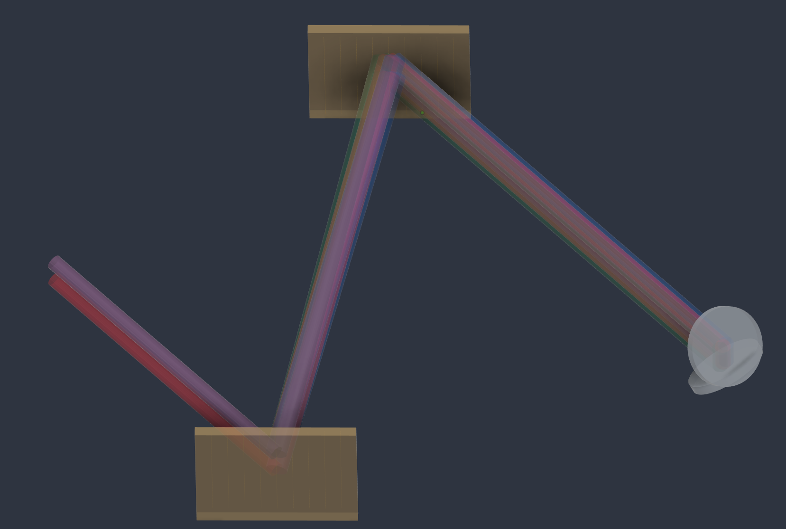

# LaserOpticsRouter (Work in progress)

**Quick visual representation of optical layouts in Autodesk Fusion.**

> **Purpose and scope:** LaserOpticsRouter is a visualization aid, not an
> optical simulation or design-validation package. Its simplified geometric
> and paraxial calculations generate illustrative beam shapes and wavelength
> paths; they are not validated predictions of optical performance. Independently
> verify layouts and numerical values using trusted optical-design software
> such as Zemax OpticStudio, appropriate analytical or hand calculations, and
> experimental checks where required before relying on them in a real setup.

This is a small, experimental side project developed in spare time for personal
interest and enjoyment. It is shared as a work in progress, with development
and support provided on a best-effort basis.

The add-in combines a visual sequence editor, navigable schematics, approximate
beam representations, user-supplied CAD components, and reference path-length,
loss and dispersion bookkeeping. Its purpose is to make a proposed setup
easier to sketch, communicate and arrange mechanically.

**Version 1.7.1 · Apache-2.0 · Amon P. Lanz**

[Download v1.7.1 (ZIP)](LaserOpticsRouter_v1.7.1.zip?raw=true) ·
[Browse the add-in source](LaserOpticsRouter_v1.7.1/LaserOpticsRouter) ·
[Report an issue](https://github.com/AmLanz/LaserOpticsRouter/issues)


*A standalone SVG exported by the router. Optic symbols are schematic; beam
geometry and the grid use millimetres.*

## What it does

- Edit optical paths visually or with compact commands. Insert useful presets,
  move or duplicate steps, and retain prepared component assignments.
- Pan and zoom XY/XZ/YZ schematics with oriented optical symbols. Select an
  endpoint to highlight its complete known contributing path.
- Represent spherical and cylindrical lenses, mirrors, OAPs, reflection gratings,
  plate and cube beam splitters, polarizers, Wollaston and Rochon prisms,
  beam displacers, waveplates, ND filters, tweaker plates, virtual reset markers,
  and generic disc, cube or ball placeholders.
- Assign real CAD components while planning with simple optics. Preview one
  assigned component with its origin axes before enabling full CAD placement.
- Continue from saved endpoints and splitter ports, including wavelength
  bundles. Record approximate path-length and manually assigned loss, GDD and
  glass-length budgets with explicit lists of included optics.
- Export route CSV files, router-style SVG schematics and complete document
  archives.

The drawing rules omit aberrations, polarization evolution, material ray
tracing, interference, nonlinear conversion and aperture clipping. Prism marks
are reference annotations only. Loss, GDD and glass corrections are manually
assigned estimates. A plausible-looking drawing or reported beam diameter does
not establish that the corresponding optical setup will work.

## Installation

1. Download [LaserOpticsRouter_v1.7.1.zip](LaserOpticsRouter_v1.7.1.zip?raw=true)
   and extract it to a permanent location.
2. Select the inner **`LaserOpticsRouter`** folder when registering the add-in.
   It must directly contain `LaserOpticsRouter.manifest`, `LaserOpticsRouter.py`,
   `palette.html`, the other modules and interface files, and `assets`.
   Keep this folder intact; do not select the ZIP or its outer version folder.
3. In Fusion's **Design** workspace, press **Shift+S** to open **Scripts and
   Add-Ins**, or use **Utilities → Add-Ins → Scripts and Add-Ins**.
4. Open **Add-Ins**, click **+**, choose **Script or add-in from device**, and
   select the folder containing `LaserOpticsRouter.manifest`.
5. Select **LaserOpticsRouter**, click **Run**, and check that its version badge
   reads **1.7.1**.
6. Optionally enable **Run on Startup** for the version you intend to use.

Fusion supplies the Python environment and embedded browser. No pip or npm
installation is required. The add-in is intended for desktop Fusion on Windows
or macOS. For a new setup, use **Hybrid Design**. Existing Part/Assembly documents
offer **Switch to Hybrid & build** because generated routes contain internal
components. Preview does not change the document type.

### Finding the installation directory

If scripts or add-ins are already installed but you do not know their location:

1. Press **Shift+S**.
2. Select a listed script or add-in.
3. Right-click it and choose **Open File Location**.

This opens the directory in the system file manager. A common Windows add-in
location is `%APPDATA%\Autodesk\Autodesk Fusion\API\AddIns`, but Fusion can also
link an add-in stored elsewhere. Use the location shown by your installation.

### Keeping several versions

Versioned outer folders can be kept side by side, each retaining its inner
`LaserOpticsRouter` folder:

| Version | Folder to register in Fusion |
|---|---|
| 1.6.1 | `LaserOpticsRouter_v1.6.1/LaserOpticsRouter` |
| 1.7.1 | `LaserOpticsRouter_v1.7.1/LaserOpticsRouter` |

Run **only one LaserOpticsRouter version at a time**. Versions use the same
command and palette identifiers, so running two simultaneously can interfere
with their interface handlers.

To switch versions, open **Shift+S**, stop the running version, then run the
required version. Enable **Run on Startup** for only the preferred version.
Use **Unlink** to remove an entry from Fusion's list without deleting its files.

### Updating in place

1. Save the Fusion design and stop LaserOpticsRouter through **Shift+S**.
2. Open its installed folder using **Open File Location**.
3. Replace the complete contents with the new release's inner
   `LaserOpticsRouter` folder contents.
4. Restart Fusion and check the version badge before continuing work.

Do not update only `LaserOpticsRouter.py`. The interface, renderer and backend
modules must come from the same release. Save a backup before rebuilding
important routes, particularly when migrating older component assignments.

## A first route

```text
p100 l50 p25 r90 p75
```

With the default 5 mm collimated geometric source along +X, this places a
50 mm lens, a 90° fold, and an endpoint at **(125, 75, 0) mm**. The total path
is **200 mm**, and the endpoint diameter is **5 mm**. The ideal geometric focus
occurs earlier along the reflected leg.

1. Set the source position, direction, beam model, diameter and display color.
2. Use **+ Add step**, choose a preset, and edit the selected step in Inspector.
   On a new line or run, click the starter **p100** to replace it with any
   optical or propagation step. **Commands** starts expanded for direct entry
   and can be collapsed.
3. Drag or scroll the overview to move and zoom. Use **Fit** to restore the full
   route. Select the measured endpoint below the overview to display its
   contributing path and endpoint diameter.
4. Keep **Use assigned CAD in solid preview & build** disabled while planning
   with simple optics. Assign components under
   **Defaults → Default optics & components**, and use
   **Preview this CAD only** to inspect an individual component's origin axes
   and orientation.
5. **Build** keeps the palette open, and the following build replaces the same
   saved route. **New run** starts an independent route. Save the Fusion
   document after building.

Built routes retain their configured colors when the palette closes. Connection
warnings remain visible under Saved paths without dimming existing geometry.

## Generic optics and beam colors

For an optic that is not in the standard palette, add `g`, uncheck
**Use default**, and give it a label such as “BBO”. Choose a disc, cube or ball
representation and enter its reference loss, GDD, refractive index and effective
glass thickness.

The source and a generic optic can assign a downstream display color. This is a
visual label and does not change the modeled wavelength or simulate nonlinear
frequency conversion.

## Saved paths and budgets

Under **Budget & export**, select paths to assign editable highlight colors.
Each result lists the exact commands and optics included in the calculation,
including the correct transmitted or reflected splitter port and any trimmed
parent prefix.

Independently created paths join when an endpoint and subsequent start agree in
position and forward direction. A unique intermediate path is included and
listed automatically. Ambiguous connections require an explicit selection.

Under **Saved paths & endpoints**, highlight a route or endpoint in the overview
before opening it for editing.

## Reusable components and defaults

Prepare each reference component in **its own Fusion file**. Put its origin
at the intended beam hit and make **X perpendicular to the optical reference
surface**. For a mirror, normal incidence along −X reflects back along +X.
Insert the saved file into the setup, preferably as a linked component.

**Defaults → Default optics & components** stores the prepared component and
its reference properties. **Choose component…** lists inserted occurrences
by name and assembly path, including hidden references and excluding generated
routes. Use **Preview this CAD only** to inspect the placed X/Y/Z axes.

By default, component Z stays parallel to positive Hybrid assembly Z for
horizontal normals. For tilted surfaces it follows assembly Z projected onto
the surface. **Component rotation & assembly offsets** provides fixed
source-axis Rx/Ry/Rz corrections before alignment, and translations in assembly
coordinates. For example, Rz = −90° makes the original +Y axis the optical
normal. These corrections affect CAD placement only. Optical h/v and `_`
modifiers do not automatically roll assigned CAD; set explicit Rx where required.

New optics start with **Use default** enabled. Disable it for an independent
local assignment; re-enable it to follow the global default again. Without an
assigned component, the built-in planning shape is used. Defaults belong to
the active Fusion document, and built routes retain their pinned settings.

**Migration:** rebuilt saved routes use X-normal too. Former Z-normal datum
calibration is ignored. Existing geometry stays in place until rebuilt; inspect
older assignments before replacing them.

All plate-splitter angles/signs share one physical default per nominal size.
Optional transmission displacement shifts only the transmitted beam; reflection
starts at the original incident hit. Cylindrical h/v variants share a physical
specification, and gratings share density/size across incidence and order.

## Passive and displacement optics

| Command | Planning behavior |
|---|---|
| `laha` | Half-wave plate represented by a thin disc; manual loss, GDD and glass budget |
| `laqu` | Quarter-wave plate represented by a thin disc; manual loss, GDD and glass budget |
| `nd` | Thicker ND-filter disc; adjustable example OD 1 / 90% loss |
| `tp30d0.5` | Plate normal tilted by 30°; outgoing parallel beam displaced by 0.5 mm |
| `g` | Generic disc, cube or ball with custom reference properties and optional outgoing color |

Waveplates and ND filters leave the modeled beam envelope and display color
unchanged. Tweaker displacement is entered explicitly and is not calculated
from refractive index. Reference budgets do not validate optical performance.

See the
[optical reference](LaserOpticsRouter_v1.7.1/LaserOpticsRouter/docs/REFERENCE.md)
for complete command, angle and side conventions.

## Cylindrical lenses, gratings and reset markers

| Command | Drawing behavior |
|---|---|
| `cyl100h`, `cyl100v` | 100 mm cylindrical lens; h/v selects the powered transverse plane |
| `gr600a-45m-1h` | Reflection grating: 600 lines/mm, −45° incidence, order −1, horizontal dispersion |
| `resetd5finf` | Keep position/direction and impose a circular 5 mm collimated envelope |
| `resetd5f50` | Impose a circular 5 mm envelope with a nominal focus 50 mm ahead |

Under **Source**, choose the central wavelength, two sidebands at λ₀ ± Δλ,
or a Gaussian wavelength spectrum specified by intensity FWHM. Spectral
sampling and the Gaussian spatial-beam drawing option are independent settings.
Samples begin at the first grating and continue through later optics and return
passes. Copying the central endpoint retains the wavelength bundle.

This supports visual layouts of grating compressors. It does **not** calculate
spectral phase, automatic grating GDD/TOD, diffraction efficiency or compressed
pulse duration. Sample weights are relative intensity labels, not independent
full-power beams. Reset markers impose a drawing boundary condition; they are
not physical collimators.

Importable examples are described in the
[example guide](LaserOpticsRouter_v1.7.1/LaserOpticsRouter/examples/README.md):

- [Double-pass compressor with sidebands](LaserOpticsRouter_v1.7.1/LaserOpticsRouter/examples/compressor_sidebands.csv?raw=true)
- [Same compressor with a Gaussian spectrum](LaserOpticsRouter_v1.7.1/LaserOpticsRouter/examples/compressor_gaussian.csv?raw=true)
- [3D OAP/cylindrical relay and Wollaston pair](LaserOpticsRouter_v1.7.1/LaserOpticsRouter/examples/oap_cylinder_3d.csv?raw=true)

The compressor examples use two parallel gratings, four grating encounters,
and a roof-mirror return separating input/output by 10 mm in Z. Matching
coplanar return encounters reuse the first physical grating by default.
Use **Budget & export → Import CSV** to load the source settings with each route.

The Reference tab also includes this 3D example:

```text
p100 l50 p25 r90 p75 _r90f50 p50 r90v45 p100 cyl100h p200 cyl100h p50 r-90v-45 p100 wp20h p50
```

## Example visualizations

### Cylindrical lenses


*Cylindrical-lens geometry and an approximate beam envelope displayed in Fusion.
The rendered focus and beam shape are visual aids and require independent
optical verification.*

### Grating compressor



*A grating-compressor layout with wavelength paths represented by colored beams.
This drawing illustrates the arrangement; it does not demonstrate or predict
temporal pulse compression.*

## Documentation

| Guide | Contents |
|---|---|
| [Quick start](LaserOpticsRouter_v1.7.1/LaserOpticsRouter/QUICKSTART.md) | Workflow, presets, navigation, generic optics and budgets |
| [Component preparation](LaserOpticsRouter_v1.7.1/LaserOpticsRouter/docs/COMPONENTS.md) | Origin and axis conventions, individual-component inspection, links, protection and build performance |
| [Optical reference](LaserOpticsRouter_v1.7.1/LaserOpticsRouter/docs/REFERENCE.md) | Commands, coordinate conventions, beam models, endpoints and budgets |
| [Verification record](LaserOpticsRouter_v1.7.1/LaserOpticsRouter/TESTING.md) | Portable coverage, historical regressions and outstanding native Fusion checks |
| [Changelog](LaserOpticsRouter_v1.7.1/LaserOpticsRouter/CHANGELOG.md) | Public release history |
| [Contributing](LaserOpticsRouter_v1.7.1/LaserOpticsRouter/CONTRIBUTING.md) | Issue reports, development boundaries and test expectations |

## Development and verification

Run the portable test suites from the add-in source directory:

```sh
cd LaserOpticsRouter_v1.7.1/LaserOpticsRouter
python -m unittest discover -s tests -q
node --test tests/*.cjs
```

Version 1.7.1 passes **308 Python tests and 120 JavaScript tests**. These tests
cover drawing calculations, persistence behavior, API doubles and DOM
controllers. They do not execute Fusion's native BRep kernel, transaction system
or embedded browser, and they do not establish the optical accuracy of a real
setup. Passing software tests is not optical validation.

The exported schematic SVGs were rendered and inspected separately. Native
build, cancellation, Undo, save/reopen, external-reference updates and platform
UI checks remain documented in the
[verification record](LaserOpticsRouter_v1.7.1/LaserOpticsRouter/TESTING.md).

Community support is provided on a best-effort basis, without a guaranteed
response time. When reporting a problem, include the LaserOpticsRouter and Fusion
versions, operating system, document type, minimal route, expected result,
actual result and relevant diagnostic output. Remove private paths, component
names and project information before sharing logs or screenshots.

## License and independence

Copyright 2026 **Amon P. Lanz**.

LaserOpticsRouter is distributed under the
[Apache License 2.0](LICENSE). The accompanying
[NOTICE](LaserOpticsRouter_v1.7.1/LaserOpticsRouter/NOTICE) file contains the
project attribution.

This is an independent project and is not affiliated with, endorsed by, or
sponsored by Autodesk.

The software is provided “AS IS”, without warranties or conditions of any kind,
as set out in the Apache License 2.0. To the extent permitted by applicable law,
Amon P. Lanz and contributors accept no liability for losses or damages arising
from its use, including errors, bugs or inaccurate results. Users are responsible
for independently verifying layouts and calculations before relying on them.
Nothing in this notice excludes liability that cannot lawfully be excluded.

## Citation

If LaserOpticsRouter contributes to your work, a software citation is
appreciated:

> Amon P. Lanz (2026). *LaserOpticsRouter* (version 1.7.1). Computer software.  
> https://github.com/AmLanz/LaserOpticsRouter

The repository includes
[CITATION.cff](LaserOpticsRouter_v1.7.1/LaserOpticsRouter/CITATION.cff) and a
[BibTeX entry](LaserOpticsRouter_v1.7.1/LaserOpticsRouter/CITATION.bib).
Citation is optional.
