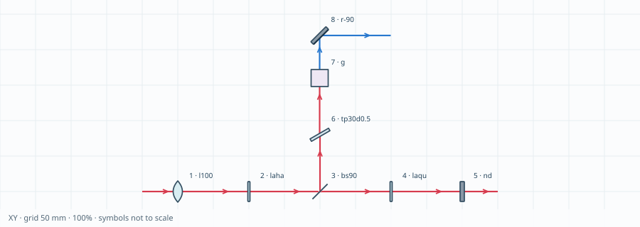

# LaserOpticsRouter

**Sketch an optical setup. Check its path. Place the hardware when ready.**

LaserOpticsRouter is a desktop Autodesk Fusion add-in for physicists and optics
engineers planning laser and optical setups. It combines a visual sequence
editor, a navigable schematic, approximate beam envelopes, reusable CAD optics,
and transparent path-length, loss and dispersion bookkeeping.

**Version 1.6.1 · Apache-2.0 · Amon P. Lanz**

[Download the latest release](https://github.com/AmLanz/LaserOpticsRouter/releases/latest) ·
[Browse the add-in source](LaserOpticsRouter_v1.6.1/LaserOpticsRouter) ·
[Report an issue](https://github.com/AmLanz/LaserOpticsRouter/issues)



*A standalone SVG exported by the router. Optic symbols are schematic; beam
geometry and the grid use millimetres.*

## What it does

- Edit optical paths visually or with compact commands. Insert useful presets,
  move or duplicate steps, and retain calibrated component assignments.
- Pan and zoom XY/XZ/YZ schematics with oriented optical symbols. Select an
  endpoint to highlight its complete known contributing path.
- Sketch lenses, mirrors, off-axis parabolic mirrors, plate and cube beam
  splitters, polarizers, Wollaston and Rochon prisms, beam displacers,
  half-wave and quarter-wave plates, ND filters, tweaker plates, and generic
  disc, cube or ball placeholders.
- Assign real CAD components while planning with simple optics. Preview one
  assigned component with datum axes before enabling full CAD placement.
- Continue from saved endpoints and splitter ports. Calculate connected
  path-length, loss, GDD and effective-glass budgets with editable highlight
  colors and explicit lists of included optics.
- Export route CSV files, router-style SVG schematics and complete document
  archives.

LaserOpticsRouter is a layout and planning tool. It does **not** replace Zemax
or a detailed optical solver. The geometric and simplified Gaussian models omit
aberrations, polarization evolution, material ray tracing, interference,
nonlinear conversion and mechanical collision checking. Prism symbols carry
reference polarization marks only. Loss, GDD and glass corrections are manually
assigned estimates.

## Installation

1. Download
   [`LaserOpticsRouter_v1.6.1.zip`](https://github.com/AmLanz/LaserOpticsRouter/releases/download/v1.6.1/LaserOpticsRouter_v1.6.1.zip).

2. Extract the ZIP. The folder selected in Fusion must directly contain:

   ```text
   LaserOpticsRouter.manifest
   LaserOpticsRouter.py
   palette.html
   assets\
   ```

   Do not select the ZIP itself.

3. Store the extracted folder in a permanent location.

   The standard Windows add-in directory is:

   ```text
   %APPDATA%\Autodesk\Autodesk Fusion\API\AddIns
   ```

   However, Fusion can also link an add-in stored elsewhere. For example, you
   can keep versioned folders side by side:

   ```text
   %APPDATA%\Autodesk\Autodesk Fusion 360\API\Scripts\
       LaserOpticsRouter_v1.5.0\
       LaserOpticsRouter_v1.6.0\
       LaserOpticsRouter_v1.6.1\
   ```

   This makes it easy to retain a known working version while testing an update.

4. In Fusion, press **Shift+S** to open **Scripts and Add-Ins**. The same dialog
   is available from:

   **Utilities → Add-Ins → Scripts and Add-Ins**

5. Open the **Add-Ins** tab and click the **+** button. Choose
   **Script or add-in from device**, then select the extracted folder containing
   `LaserOpticsRouter.manifest`.

6. Select **LaserOpticsRouter** in the list and click **Run**.

7. Optionally enable **Run on Startup** when you have settled on the version you
   want to use.

### Finding the installation directory

If scripts or add-ins are already installed but you do not know where Fusion
stores them:

1. Press **Shift+S**.
2. Select any listed script or add-in.
3. Right-click it and choose **Open File Location**.

This opens its directory in the system file manager and provides a convenient
starting point for locating Fusion's `API`, `Scripts` or `AddIns` directories.

### Keeping several versions

Several LaserOpticsRouter versions may be stored and linked side by side. Give
each extracted folder a versioned name such as:

```text
LaserOpticsRouter_v1.6.0
LaserOpticsRouter_v1.6.1
```

Only run **one LaserOpticsRouter version at a time**. The versions use the same
Fusion command and palette identifiers, so running two simultaneously can
replace interface handlers or remove each other's controls.

When switching versions:

1. Press **Shift+S**.
2. Select the running LaserOpticsRouter version and click **Stop**.
3. Select the required version and click **Run**.
4. Enable **Run on Startup** for only the preferred version.

Linked versions can be removed from Fusion's list without deleting their files.
Select the entry and use **Unlink**. The version folder remains on disk and can
be linked again later.

### Updating in place

To replace an existing installation instead:

1. Save the Fusion design.
2. Stop LaserOpticsRouter through **Shift+S**.
3. Open its folder using **Open File Location**.
4. Replace the complete folder contents with the contents of the new release's
   inner `LaserOpticsRouter` folder.
5. Restart Fusion and check the version badge before continuing work.

Do not update only `LaserOpticsRouter.py`. The interface, schematic renderer,
documentation and backend modules are separate files and must remain from the
same release.

## A first route

```text
p100 l50 p25 r90 p75
```

With the default 5 mm collimated geometric source along +X, this places a
50 mm lens, a 90° fold, and an endpoint at **(125, 75, 0) mm**. The total path
is **200 mm**, and the endpoint diameter is **5 mm**. The ideal geometric focus
occurs earlier along the reflected leg.

1. Set the source position, direction, beam model, diameter and display color.
2. Use **+ Add step**, choose a preset, and edit the selected step in Inspector.
   On a new line or run, click the starter **p100** to replace it with any
   optical or propagation step. **Commands** starts expanded for direct entry
   and can be collapsed.
3. Drag or scroll the overview to move and zoom. Use **Fit** to restore the full
   route. Select the measured endpoint below the overview to display its
   contributing path and endpoint diameter.
4. Keep **Use assigned CAD in solid preview & build** disabled while planning
   with simple optics. Assign components under
   **Defaults → Default optics & components**, and use
   **Preview this CAD only** to verify an individual component's datum and
   orientation.
5. **Build** keeps the palette open, and the following build replaces the same
   saved route. **New run** starts an independent route. Save the Fusion
   document after building.

Built routes retain their configured colors when the palette closes. Connection
warnings remain visible under Saved paths without dimming existing geometry.

## Generic optics and beam colors

For an optic that is not in the standard palette, add `g`, uncheck
**Use default**, and give it a label such as “BBO”. Choose a disc, cube or ball
representation and enter its reference loss, GDD, refractive index and effective
glass thickness.

The source and a generic optic can assign a downstream display color. This is a
visual label and does not change the modeled wavelength or simulate nonlinear
frequency conversion.

## Saved paths and budgets

Under **Budget & export**, select paths to assign editable highlight colors.
Each result lists the exact commands and optics included in the calculation,
including the correct transmitted or reflected splitter port and any trimmed
parent prefix.

Independently created paths join when an endpoint and subsequent start agree in
position and forward direction. A unique intermediate path is included and
listed automatically. Ambiguous connections require an explicit selection.

Under **Saved paths & endpoints**, highlight a route or endpoint in the overview
before opening it for editing.

## Reusable components and defaults

**Defaults → Default optics & components** stores the component, datum, XYZ
offsets, rotations and reference properties for each physical optic.

Newly inserted optics start with **Use default** enabled. Disable it for an
independent local component or calibration; re-enable it to follow the global
default again. If no component is assigned, the built-in planning shape is used.

Defaults belong to the active Fusion document because their component references
belong to that document. Existing built routes retain their saved component and
calibration until deliberately edited and rebuilt.

All plate-beam-splitter angles and signs share one physical default per nominal
size. For example, `bs30` and `bs-90` use the same normal-size plate-splitter
default. Optional transmission displacement is zero by default. It shifts only
the transmitted beam; the reflected beam starts at the original incident point.

## Passive and displacement optics

| Command | Planning behavior |
|---|---|
| `laha` | Half-wave plate represented by a thin disc; manual loss, GDD and glass budget |
| `laqu` | Quarter-wave plate represented by a thin disc; manual loss, GDD and glass budget |
| `nd` | Thicker ND-filter disc; adjustable example OD 1 / 90% loss |
| `tp30d0.5` | Plate normal tilted by 30°; outgoing parallel beam displaced by 0.5 mm |
| `g` | Generic disc, cube or ball with custom reference properties and optional outgoing color |

Waveplates and ND filters leave the modeled beam envelope and display color
unchanged. Tweaker displacement is entered explicitly and is not calculated
from refractive index. Gratings are outside the current model.

See the
[optical reference](LaserOpticsRouter_v1.6.1/LaserOpticsRouter/docs/REFERENCE.md)
for complete command, angle and side conventions.

## Documentation

| Guide | Contents |
|---|---|
| [Quick start](LaserOpticsRouter_v1.6.1/LaserOpticsRouter/QUICKSTART.md) | Workflow, presets, navigation, generic optics and budgets |
| [Component preparation](LaserOpticsRouter_v1.6.1/LaserOpticsRouter/docs/COMPONENTS.md) | Origin and axis conventions, individual-component inspection, links, protection and build performance |
| [Optical reference](LaserOpticsRouter_v1.6.1/LaserOpticsRouter/docs/REFERENCE.md) | Commands, coordinate conventions, beam models, endpoints and budgets |
| [Verification record](LaserOpticsRouter_v1.6.1/LaserOpticsRouter/TESTING.md) | Portable coverage, historical regressions and outstanding native Fusion checks |
| [Changelog](LaserOpticsRouter_v1.6.1/LaserOpticsRouter/CHANGELOG.md) | Public release history |
| [Contributing](LaserOpticsRouter_v1.6.1/LaserOpticsRouter/CONTRIBUTING.md) | Issue reports, development boundaries and test expectations |

## Development and verification

Run the portable test suites from the add-in source directory:

```sh
cd LaserOpticsRouter_v1.6.1/LaserOpticsRouter
python -m unittest discover -s tests -q
node --test tests/*.cjs
```

Version 1.6.1 passes **239 Python tests and 107 JavaScript tests**. These tests
include optical calculations, persistence behavior, API doubles and DOM
controllers. They do not execute Fusion's native BRep kernel, transaction system
or embedded browser.

The exported schematic SVGs were rendered and inspected separately. Native
build, cancellation, Undo, save/reopen, external-reference updates and platform
UI checks remain documented in the
[verification record](LaserOpticsRouter_v1.6.1/LaserOpticsRouter/TESTING.md).

Community support is provided on a best-effort basis, without a guaranteed
response time. When reporting a problem, include the LaserOpticsRouter and Fusion
versions, operating system, document type, minimal route, expected result,
actual result and relevant diagnostic output. Remove private paths, component
names and project information before sharing logs or screenshots.

## License and independence

Copyright 2026 **Amon P. Lanz**.

LaserOpticsRouter is distributed under the
[Apache License 2.0](LICENSE). The accompanying
[NOTICE](LaserOpticsRouter_v1.6.1/LaserOpticsRouter/NOTICE) file contains the
project attribution.

This is an independent project and is not affiliated with, endorsed by, or
sponsored by Autodesk.

The software is provided “AS IS”, without warranties or conditions of any kind,
as set out in the Apache License 2.0. To the extent permitted by applicable law,
Amon P. Lanz and contributors accept no liability for losses or damages arising
from its use, including errors, bugs or inaccurate results. Users are responsible
for independently verifying layouts and calculations before relying on them.
Nothing in this notice excludes liability that cannot lawfully be excluded.

## Citation

If LaserOpticsRouter contributes to your work, a software citation is
appreciated:

> Amon P. Lanz (2026). *LaserOpticsRouter* (version 1.6.1). Computer software.  
> https://github.com/AmLanz/LaserOpticsRouter

The repository includes
[CITATION.cff](LaserOpticsRouter_v1.6.1/LaserOpticsRouter/CITATION.cff) and a
[BibTeX entry](LaserOpticsRouter_v1.6.1/LaserOpticsRouter/CITATION.bib).
Citation is optional.
